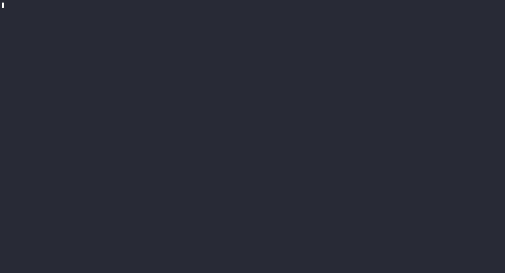

# 🧠 Neural Network TUI Dashboard (from Scratch in Rust)

[](https://github.com/nathan-trioleyre/neural-network-hello-world)
[]()
[](https://github.com/ratatui/ratatui)
[]()

A beautiful, concurrent, and modular terminal-based dashboard for training and predicting digits using a Neural Network built from scratch in Rust on the MNIST dataset.



## ✨ Features

- **Neural Network from Scratch**: Multi-Layer Perceptron (MLP) with 4 layers (`784 -> 16 -> 16 -> 10`), Backpropagation, Sigmoid activation, and Stochastic Gradient Descent (SGD).
- **Lock-Free Multithreaded Engine**: The training runs on a background thread while the TUI runs on the main thread at 60 FPS. They communicate asynchronously via thread-safe `mpsc` channels (avoiding UI lags and deadlocks).
- **Dynamic Loss History Chart**: Real-time rendering of validation loss using Ratatui's Unicode `Sparkline` widget, scrolling dynamically to the right as epochs complete.
- **Accurate Real-Time Chronometer**: Measures execution duration precisely down to tenth-of-a-second (`MM:SS.d`), supporting pause and resume accumulation.
- **Interactive Hyperparameter Configuration**:
  - Adjust the **Learning Rate** on the fly using `+` and `-`.
  - Adjust the **Total Epochs** target using `Up`/`Down` and `PageUp`/`PageDown` keys.
- **Solid Architecture (SOLID / MVC)**:
  - Clean separation between Model (State), Controller (Events/Key handler), and View (Ratatui rendering).
  - Encapsulated dataset retrieval, math helpers, and trainer controls.

## 🚀 How to Run

### Prerequisites
Make sure you have Rust and Cargo installed. (Minimum version: `1.80`)

### Installation & Run
1. Clone the repository:
   ```bash
   git clone https://github.com/nathan-trioleyre/neural-network-hello-world.git
   cd neural-network-hello-world
   ```

2. Run the application:
   ```bash
   cargo run --release
   ```
   *Note: Using the `--release` flag is highly recommended because training computation on 10,000 images is heavy and debug mode will run very slowly.*

## ⚖️ License
This project is licensed under the MIT License.
